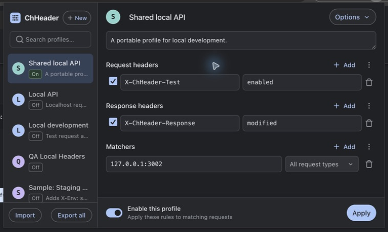
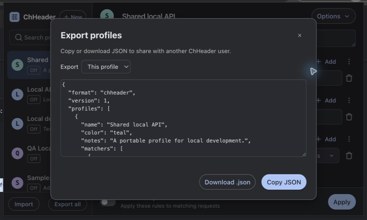

<p align="center"></p>
<h1 align="center">ChHeader</h1>
<p align="center">HTTP headers, organized into profiles.</p>
<p align="center"><a href="https://github.com/kahwee/ch-header/actions/workflows/ci.yml"></a> · <a href="https://github.com/kahwee/ch-header/releases/latest">Download</a></p>

A small Chrome extension for testing APIs and websites. Set request and response
headers, match URLs and request types, and switch between profiles stored locally.



## Install

Download and extract the ZIP from [Releases](https://github.com/kahwee/ch-header/releases/latest).
In `chrome://extensions/`, enable **Developer mode**, click **Load unpacked**, and
select the extracted folder. Pin ChHeader from Chrome's Extensions menu.
To update, replace the files and click **Reload**. Distribution is through GitHub;
Chrome Web Store installation is not available yet.

## Use and share

- **New:** name a profile, add headers and a URL matcher, then turn it on. Only one
  profile is on at a time. Edits save automatically; **Apply** reapplies the rules.
- **On / Off:** sidebar badges show whether a profile is enabled. Selecting a
  profile only opens its editor.
- **Right-click a profile:** turn it on/off, rename, duplicate, copy JSON, export
  or delete. **Undo** restores the last deleted profile, off, while the popup is open.
  Options also contains duplicate, delete and sharing actions.
- **Import:** paste JSON or choose a file. Imports become new profiles and start off.
  **Export all** shares a collection; **Options → Export JSON** shares one profile.
  Export blanks common credential headers by default; review the JSON before sharing.

Try the [localhost example](docs/examples/local-profile.json). Matchers accept hosts
(`127.0.0.1:3002`), wildcard paths (`127.0.0.1:3002/match/*`) and
`regex:` patterns. Empty matchers cover all URLs. Disable profiles while editing
incomplete regex patterns; inline validation is planned.



The screenshots show the current source. Features added after the latest tag
will be included in the next release.

## Develop and test

Use Node and pnpm versions declared in the repository.

```sh
pnpm install --frozen-lockfile
pnpm check          # types, formatting, coverage, extension ZIP and Storybook
pnpm test:headers   # real header fixture at http://127.0.0.1:3002
```

Load `dist/` unpacked in Chrome. `pnpm dev:extension` rebuilds on edits; reload
ChHeader after rebuilding. `pnpm test:workflows` runs focused sharing/action tests.
See [testing](TESTING.md) and [contributor guidance](AGENTS.md).

## Roadmap and releases

| Stage      | Focus                                                                 | Timing                  |
| ---------- | --------------------------------------------------------------------- | ----------------------- |
| 0.3.0      | Chrome-style UI, matching fixes, automated releases                   | Released September 2026 |
| Next minor | Profile sharing, right-click actions, visible status, cleanup         | After verification      |
| Next       | Inline rule errors, light/system theme, broader accessibility testing | As ready                |
| Later      | Wider platform testing and Chrome Web Store distribution              | To be evaluated         |

CI checks pull requests and main pushes. An annotated `vX.Y.Z` tag validates the
version and publishes a ZIP and SHA-256 checksum. Release dates are tentative;
there are no scheduled CI jobs. [Release notes](RELEASE_NOTES.md).
