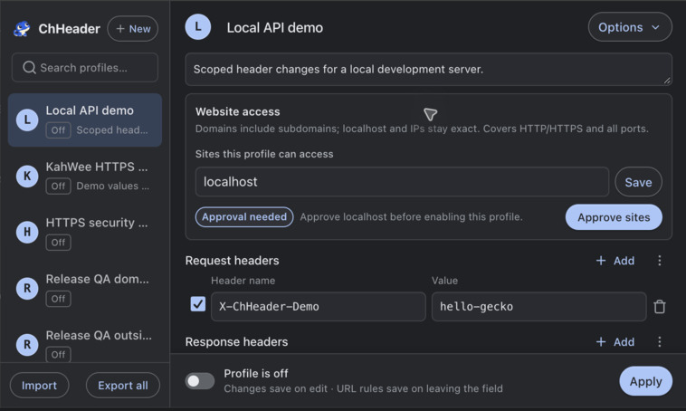

<p align="center"></p>
<h1 align="center">ChHeader</h1>
<p align="center">By <a href="https://kahwee.com">KahWee Teng</a> · No ads. Local profiles. Open source.</p>
<p align="center">Edit HTTP request and response headers in Chrome.</p>
<p align="center"><a href="https://chromewebstore.google.com/detail/chheader/okmjidkmnlobbppegojfcedhaakadgig">Install from Chrome Web Store</a> · <a href="https://www.youtube.com/watch?v=Im4QWpc7FiQ">Watch the demo</a> · <a href="https://kahwee.com/2026/why-i-built-chheader/">Why I built it</a></p>

I’m [KahWee Teng](https://kahwee.com). I built ChHeader because ModHeader’s
[ad injection](https://news.ycombinator.com/item?id=37772829) put me off.
I wanted a header editor without ads, with local profiles and code I could inspect.

Use it, fork it, or build your own. Reviews of the [permissions](src/manifest.json)
and [header rules](src/lib/dnr-rules.ts) are welcome.

## Install

Install [ChHeader from the Chrome Web Store](https://chromewebstore.google.com/detail/chheader/okmjidkmnlobbppegojfcedhaakadgig),
then pin it to Chrome's toolbar. Store installations receive updates through Chrome.

For manual installation, download and extract the ZIP from [GitHub Releases](https://github.com/kahwee/ch-header/releases/latest).
In `chrome://extensions/`, enable **Developer mode**, choose **Load unpacked**,
select the extracted folder, then pin ChHeader. To update, replace those files and
click **Reload**.

This README describes `main`. Store and GitHub release timing can differ; check
the [GitHub release notes](https://github.com/kahwee/ch-header/releases) for your
installed version.

## See it in Chrome

<p align="center"></p>

<p align="center">
  
  
</p>

Website access is explicit: save a narrow hostname, approve it in Chrome, then turn
the profile on. The local test above received `X-ChHeader-Demo: hello-gecko` from a
real Chrome request. The [capture guide](docs/screenshots/README.md) keeps README,
Store and video media reproducible.

## Try it

Open the [HTTPS header tester](https://headers.kahwee.com). Import the
[ready-made test profile](docs/examples/https-profile.json), or set up one site:

1. Create a profile. Under **Website access**, set the site to `headers.kahwee.com`,
   choose **Save**, then **Approve sites**.
2. Choose **URL pattern** and enter `|https://headers.kahwee.com/headers/match|`.
3. Add request header `X-ChHeader-Test: hello-gecko` and response header `X-ChHeader-Response: modified`.
4. Turn the profile **on**. If Chrome closes the popup while showing its native
   permission prompt, reopen ChHeader, select the profile, and turn it on again.
5. Reload the test pages, then click **Run checks**. Only the matching path should change.
   Turn the profile off and run again to compare.

Use demo values on the public tester. For secrets, run `pnpm test:headers` locally
at `http://127.0.0.1:3002`. The [tester source](tools/header-echo) is included.

## Why the permissions exist

`storage` keeps your profiles locally. `declarativeNetRequestWithHostAccess` lets
Chrome apply header rules to approved sites. Optional HTTP/HTTPS host patterns
let ChHeader **ask** for hosts you choose; installation grants no website access.

For a page at `app.example.com` calling `api.example.com`, approve both hostnames.
Choose **URL pattern** `|https://api.example.com/v1/` and **XHR/Fetch** to change
only those HTTPS API requests. Avoid approving the parent `example.com`.

- **Allowed sites bound the destinations.** Current grants include subdomains,
  HTTP/HTTPS and all ports; URL rules narrow actual changes. Regex cannot escape
  the profile's site list. No URL rules means no changes.
- **Off is not revoked.** Disabling a profile stops its rules. Chrome retains
  grants, including sites removed from a profile. Use **Revoke all access**,
  then approve only what you still need. Updates also reset grants.
- **Secrets stay your responsibility.** Local profiles have no extra encryption.
  Exports blank common credential headers; review custom values and notes.

New and imported profiles start off. Rejected rule updates clear old rules and
turn profiles off. No ads, analytics or remote code.

Read [permission tradeoffs and narrower setups](docs/permissions.md),
[privacy](PRIVACY.md), and [verification instructions and results](TESTING.md).

## Everyday use

Use **Site** for a hostname and optional port, **URL pattern** for Chrome’s filter
syntax, or **Regex** for advanced matching. **All allowed sites** covers the whole
profile site list. Each rule can also filter request types.

Selecting a profile does not enable it. Edits save automatically; URL rules save
on blur. Invalid URL drafts keep the last saved rule. **Apply** reapplies saved
rules. Use **Options** to duplicate, export or delete; **Import** accepts JSON.

## Develop

Use Node from [.node-version](.node-version) and the exact pnpm version in
[package.json](package.json). Biome handles formatting and linting.

```sh
pnpm install --frozen-lockfile
pnpm test:fast
pnpm check          # format, lint, types, tests, extension ZIP and Storybook
pnpm dev:extension  # load dist/ unpacked; reload Chrome after edits
```

[Development and architecture](CONTRIBUTING.md) · [Agent guidance](AGENTS.md) ·
[MIT license](LICENSE) · Copyright 2026 KahWee Teng.
