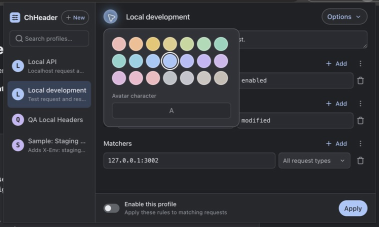

<p align="center"></p>
<h1 align="center">ChHeader</h1>
<p align="center">HTTP headers, organized into profiles.</p>
<p align="center">
  <a href="https://github.com/kahwee/ch-header/actions/workflows/ci.yml"></a>
  <a href="https://github.com/kahwee/ch-header/releases/latest">Download the latest release</a>
</p>

ChHeader is a small Chrome extension for developers testing APIs and websites.
Set request and response headers, scope them to URLs and request types, and
switch between saved profiles. It uses Manifest V3 declarative rules and stores
profiles locally in your browser.


## What it does

- Set or replace request and response headers, with per-header toggles.
- Match domains, wildcard paths or `regex:` patterns; filter Documents, XHR/Fetch
  and other request types.
- Search profiles, add notes, choose a color, duplicate, or import JSON.
- Keep editing compact: Chrome-inspired dark colors, a scrolling editor and an
  always-visible Apply footer. One profile is active at a time.

<details>
<summary>Profile colors and controls</summary>



A cohesive tonal palette, legible initials, and subtle elevation on menus and
controls keep profiles distinct without overwhelming the editor.

</details>

## Install

1. Download the ZIP from [Releases](https://github.com/kahwee/ch-header/releases/latest)
   and extract it into a permanent folder.
2. Open `chrome://extensions/`, enable **Developer mode**, and choose **Load unpacked**.
3. Select the extracted folder containing `manifest.json`, then open ChHeader from
   Chrome's Extensions menu. Pin it for easy access.

To update, replace the files in that folder and click **Reload** in Chrome's
Extensions page. The release includes a SHA-256 checksum for the ZIP. GitHub is
currently the distribution channel; this is not a Chrome Web Store installation.

## Use a profile

Click **New**, name the profile, and add a URL matcher before enabling it. Add
header names and values, turn on **Enable this profile**, and click **Apply**.
Edits are saved locally, and edits to an enabled profile update its rules.
Turn the profile off to restore normal requests.

| Matcher             | Example                                  |
| ------------------- | ---------------------------------------- |
| Domain or localhost | `127.0.0.1:3002`                         |
| Wildcard path       | `127.0.0.1:3002/match/*`                 |
| Regular expression  | `regex:^http://127\.0\.0\.1:3002/match/` |
| All URLs            | Leave the matcher empty                  |

Matchers follow Chrome's [declarativeNetRequest rules](https://developer.chrome.com/docs/extensions/reference/api/declarativeNetRequest).
Regex syntax follows RE2. Disable the profile while editing an incomplete regex;
inline validation is not yet available. Chrome controls which headers and browser
pages extensions can modify.

Try **Options → Import profile** with [this localhost example](docs/examples/local-profile.json).
Imports start disabled. The extension requests site access to apply headers across
the URLs you configure; keep test profiles scoped to the intended hosts.

## Develop and test

Use Node **26.7.0** and pnpm **11.25.0** (also declared in the repository):

```sh
pnpm install --frozen-lockfile
pnpm build
```

Load `dist/` unpacked in Chrome. `pnpm dev:extension` rebuilds on changes; reload
ChHeader in Chrome after rebuilding. `pnpm dev` serves a web preview, while
`pnpm storybook` opens isolated component examples.

```sh
pnpm typecheck
pnpm format:check
pnpm test:coverage
pnpm build:package
pnpm storybook:build
pnpm test:headers
```

The last command starts the localhost fixture at `http://127.0.0.1:3002/`.
It shows the headers received by the server and returned through Chrome, so you
can verify the installed extension rather than relying on mocked APIs.

<details>
<summary>See a real localhost test result</summary>


Captured in Chrome with the localhost profile enabled and **All request types**
selected. The popup screenshot above uses the same setting.

</details>

See [TESTING.md](TESTING.md) for the test matrix, results, known limits and release
checklist; [AGENTS.md](AGENTS.md) for contributor guidance; and
[design QA](design-qa.md) for the before/after review.

## Roadmap and releases

The aim is a dependable, compact developer tool that feels at home in Chrome.
This is a rough sequence, not a promise of delivery dates.

| Stage        | Focus                                                                                       | Timing                       |
| ------------ | ------------------------------------------------------------------------------------------- | ---------------------------- |
| 0.3.0        | Chrome-style UI, refreshed identity, matching fixes, repeatable QA and release automation   | September 2026               |
| Next patches | Feedback-driven fixes, clearer rule errors and inline matcher validation                    | As fixes are verified        |
| Next minor   | Light/system theme, stronger import validation, broader keyboard and accessibility coverage | After the current UI settles |
| Later        | Profile export, wider browser/platform testing and Chrome Web Store distribution            | To be evaluated              |

CI runs on pull requests and main-branch pushes. An annotated `vX.Y.Z` tag runs the
release checks, validates the package version, and publishes a ZIP and checksum.
There are no scheduled CI jobs. Patch releases follow verified fixes; minor
releases group coherent improvements. See [release notes](RELEASE_NOTES.md).
