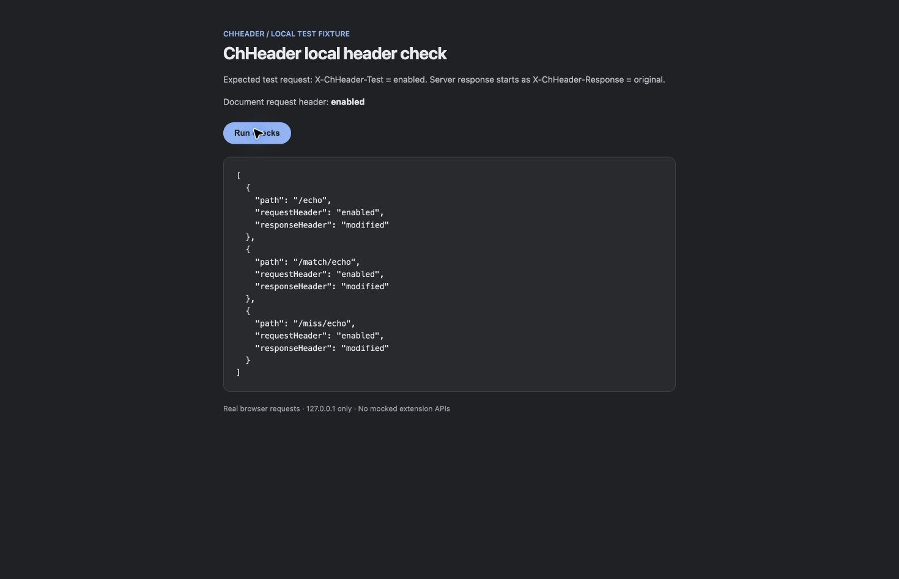

# Testing and releasing ChHeader

## Automated checks

Use Node 26.7.0 and pnpm 11.25.0, as declared in the repository.

```sh
pnpm install --frozen-lockfile
pnpm typecheck
pnpm format:check
pnpm test:coverage
pnpm build:package
pnpm storybook:build
```

`pnpm test` watches; `pnpm test:run` exits after one run. Vitest uses jsdom and
mocked Chrome APIs. It covers components, controller behavior, matchers, rule
construction, dropdown keyboard handling, and overlapping background updates.
It does not install an extension or prove Chrome accepts its rules. Coverage
reports are in `coverage/`; CI uploads them with the extension package.

## Installed-extension test

```sh
pnpm test:headers
```

The dependency-free fixture binds to `127.0.0.1:3002`. Set `CHHEADER_TEST_PORT`
to use another port and adjust the matcher. Test with the same Chrome profile
that has the extension installed.

1. Build and load `dist/` using **Load unpacked** in `chrome://extensions/`.
   After rebuilding, click ChHeader's **Reload**.
2. Open the actual toolbar popup. Use **Options → Import profile** with
   [local-profile.json](docs/examples/local-profile.json), or create a profile
   with the values below. The imported profile starts disabled.
3. Set the matcher to `127.0.0.1:3002` before enabling the profile.
4. Add request header `X-ChHeader-Test: enabled` and response header
   `X-ChHeader-Response: modified`.
5. Enable the profile and click **Apply**. Open `http://127.0.0.1:3002/` and
   click **Run checks** after each change.
6. Disable the profile afterward, verify baseline, and stop the server with Ctrl+C.

The server echoes the request headers it actually received. It always sends
`X-ChHeader-Response: original`; the browser reads the response after extension
processing. Seeing `modified` proves that Chrome changed it. The document value
comes from the root HTML request. `curl` only tests the server, not the extension.

| Case          | Setting                                  | Expected result                                      |
| ------------- | ---------------------------------------- | ---------------------------------------------------- |
| Baseline      | Profile off                              | Document absent; all fetches `(absent)` / `original` |
| Simple host   | `127.0.0.1:3002`, All request types      | Document enabled; all fetches `enabled` / `modified` |
| Wildcard      | `127.0.0.1:3002/match/*`                 | Only `/match/echo` modified                          |
| Regex         | `regex:^http://127\.0\.0\.1:3002/match/` | Only `/match/echo` modified                          |
| XHR/Fetch     | Simple host, XHR/Fetch                   | Document absent; all fetches modified                |
| Documents     | Simple host, Documents                   | Document enabled; all fetches unchanged              |
| Header toggle | Request row unchecked                    | Request absent; matching response still modified     |
| Off after use | Disable active profile                   | All requests return to baseline                      |
| Persistence   | Reopen popup and reload extension        | Saved fields and enabled state retained              |

Reload the root page for each Documents/XHR check. Direct JSON navigation is not
needed. Chrome rejected a direct JSON navigation during the initial investigation;
it was not counted as a successful document test.



## Interaction and visual checks

Use the real 744 × 440 toolbar popup. Storybook cannot reproduce all extension
window, storage, permission, and service-worker behavior.

- Add/delete request, response and matcher rows without changing the selected profile.
- Apply by button and Enter without navigation or query parameters in the popup URL.
- Add enough rows to scroll. The heading and footer stay visible; the last row,
  delete actions and request-type selector remain usable.
- Open Options and section menus. Check arrow navigation, Escape, outside dismissal
  and focus restoration. Test Duplicate and the JSON import flow.
- Change the profile color; check that the picker closes and the marker persists.
- Search by name/notes, clear the query, and check the no-results state.
- Inspect ChHeader's Errors page after reload and edits. Distinguish retained
  historical errors from newly generated ones.

## Release 0.3.0 results — 2026-09-12

Environment: macOS, installed unpacked extension in the user's Chrome profile;
Node 26.7.0 and pnpm 11.25.0. Native popup interactions and screenshots used
Computer Use. The fixture made real network requests.

| Check                                              | Result                                                                                                         |
| -------------------------------------------------- | -------------------------------------------------------------------------------------------------------------- |
| Automated suite                                    | 428 tests across 21 files passed                                                                               |
| Coverage                                           | 88.67% statements, 78.61% branches, 90.76% functions, 90.15% lines of instrumented code                        |
| TypeScript, production build, Storybook build      | Passed                                                                                                         |
| ZIP                                                | Integrity checked; manifest, popup, worker, chunks and icons present; version 0.3.0                            |
| Simple host, wildcard, regex, Documents, XHR/Fetch | Passed positive and excluded-path checks                                                                       |
| Final all-resource rules                           | Chrome accepted the expanded resource list; document and fetch checks passed                                   |
| Per-header toggle and profile disable              | Passed; final document/fetch baseline restored                                                                 |
| Add/delete, Apply, reopen/reload                   | Passed; fields retained and no form navigation                                                                 |
| Long editor                                        | Six extra request rows added; body scrolled with heading/footer and delete actions visible; blank rows removed |
| Profile color                                      | Blue selected; picker closed and marker updated                                                                |
| Options keyboard                                   | Arrow key focused Import headers; Escape closed menu and restored Options focus                                |
| Duplicate and profile import                       | Duplicate retained fields; documented JSON imported with matching values and disabled state                    |
| Search                                             | Matching results, clearing and no-results verified after fixing the unfiltered-list bug                        |
| Screenshots                                        | Actual final popup, tonal palette and successful localhost result saved in `docs/screenshots/`                 |
| Cleanup                                            | Test profiles disabled; localhost baseline verified                                                            |

The final tonal-palette pass also verified legacy hex colors, blue selection state,
legible avatar initials, elevated menus and controls, and live document/fetch changes.

The upstream popup-module refactor was integrated before release. The merged build
passed the full suite and Chrome checks for empty search, filtered keyboard selection,
and Enter-to-Apply. That last check exposed a delete button acting as the implicit
submitter; adding `type="button"` fixed it. The rebuilt popup retained both header
rows after Enter, and a regression now ensures Apply is the sole submit action.

The initial browser tests caught failures that the then-passing unit suite missed:
form submission, `regexFilter` generation, legacy Documents mapping, overlapping
rule updates and search rendering. Focused regressions accompany the fixes.
The detailed investigation history is [archived here](docs/qa/2026-09-12-test-history.md).

### Known limits

- Incomplete regex edits in an enabled profile can log Chrome validation errors.
  Disable the profile while editing complex patterns; inline feedback is future work.
- Manual checks cover this macOS/Chrome setup. Minimum-version Chrome 118,
  Windows/Linux, light/system theme, screen readers and forced colors were not certified.
- Header-only import, every section-menu action, and all keyboard paths were not
  exhaustively exercised in Chrome; automated coverage does not replace those checks.
- Font/media/WebSocket resource entries are included in rule generation and accepted
  by Chrome, but the fixture directly verifies only documents and fetches.

## Release checklist

1. Review the diff and update `package.json`, `src/manifest.json`, RELEASE_NOTES.md,
   README, screenshots and this record for the intended version.
2. Run the automated checks above and the installed-extension matrix. Inspect the
   packaged ZIP; confirm `manifest.json` matches the package version.
3. Commit and push main. Confirm the CI run for that exact commit is green.
4. Create an annotated tag, for example `git tag -a v0.3.0 -m 'ChHeader 0.3.0'`,
   and push it with `git push origin v0.3.0`.
5. The Release workflow validates the tag against `package.json`, reruns checks,
   builds the ZIP, and publishes it with its SHA-256 checksum. A failed run can
   be rerun; do not move published tags.
6. Verify the GitHub release, tag commit, archive and checksum. Download assets
   into a temporary directory and check the checksum before announcing completion.

CI runs on pull requests and main pushes; releases run on tags. There are no
scheduled jobs. A release workflow can also be dispatched on an existing version
tag. GitHub releases do not publish to the Chrome Web Store.
