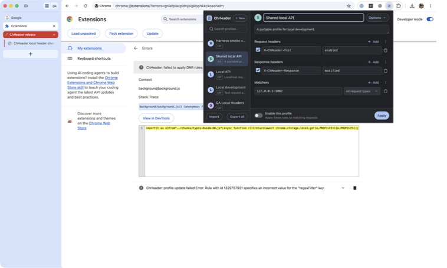
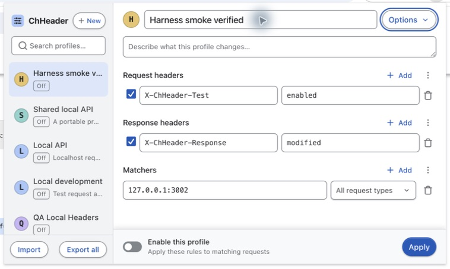
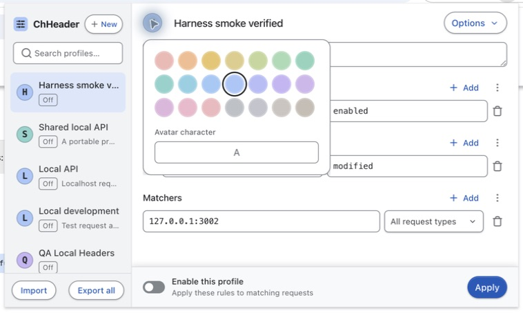
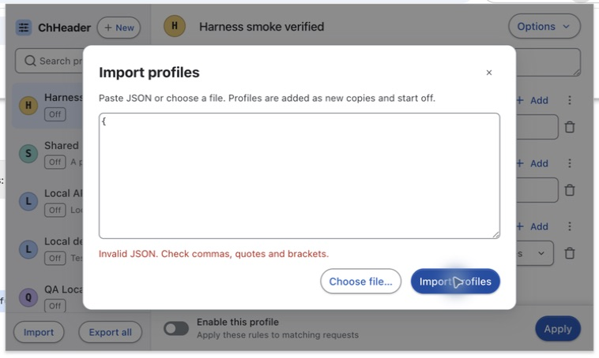
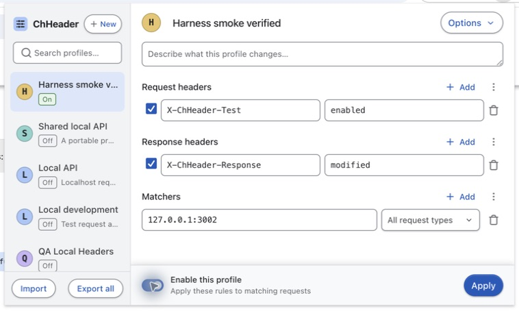
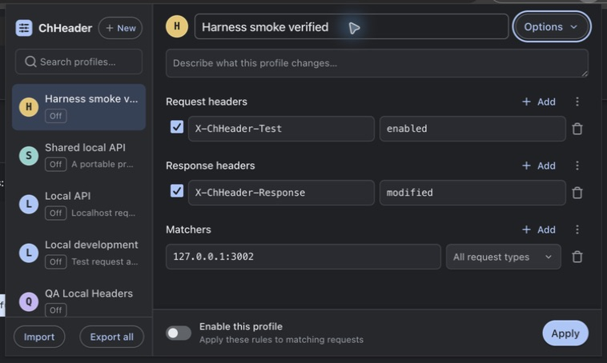

# Light-mode review — September 12, 2026

Inspected the actual Chrome toolbar popup with Computer Use. The popup uses its
744 × 440 layout; screenshots include Chrome's surrounding popup/window frame.
All profile data shown is demonstration data.

## 1. System light appearance — fixed

Before the change, Chrome became light but ChHeader remained dark. The stylesheet
forced dark colors. It now follows `prefers-color-scheme` using the shared tokens.

## 2. Editor and keyboard focus — passed

White fields, a gray sidebar and pale blue selection separate the content without
changing layout. Deep blue actions and focus outlines remain distinct. All primary
controls fit the popup, including the pinned Apply footer. Tab visibly focused
Options; the localhost demo is off.

## 3. Profile colors — passed

Existing pastel profile colors retain their stored values. The selected swatch now
has a dark outer ring in light mode. Selecting Amber persisted after reopening the
popup. Default palette initials have at least 8.66:1 source-color contrast.

## 4. Validation dialog — passed; menus partly verified

Malformed JSON showed a readable red error and left the dialog open. Buttons,
textarea boundaries and the backdrop remained distinct. Options arrow navigation
and Escape focus restoration passed; the context menu also restored focus to its
invoking profile. Computer Use returned “Screenshot unavailable” for open menus,
so their visual states are not certified by this review.

## 5. Enabled state — passed

The green On badge and blue switch are distinct from selection and the gray Off
state. Enabled only the existing `127.0.0.1:3002` demo, then disabled it. This run
checked the visual states; network effects were verified in the earlier harness
smoke test recorded in TESTING.md.

## 6. Dark appearance — passed

Restored the original Auto system appearance. The popup returned to its previous
dark palette without a reload, with the demo off and keyboard focus visible.

## Contrast and limits

Calculated from the light CSS token values using relative luminance:

| Foreground / background           |   Ratio |
| --------------------------------- | ------: |
| Main text / canvas                | 16.10:1 |
| Muted text / sidebar              |  5.44:1 |
| Muted text / selected row         |  4.86:1 |
| Primary action label / blue       |  6.51:1 |
| Primary action label / hover blue |  7.85:1 |
| Error text / dialog               |  6.54:1 |
| On label / green surface          |  5.24:1 |
| Field boundary / white field      |  3.68:1 |

These checks do not certify every custom profile color, screen reader, zoom level,
forced-color mode, platform or Chrome version. Existing historical regex errors
were retained. `pnpm check` passed: 415 tests in 23 files plus types, formatting,
coverage, ZIP packaging and Storybook. No styling framework was added.
