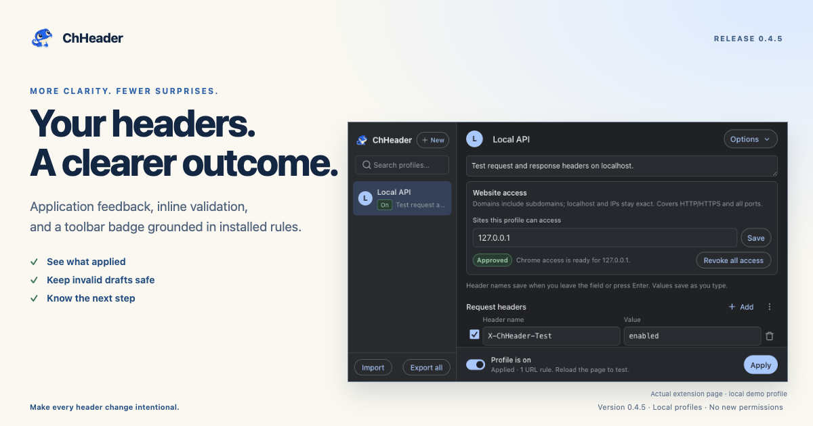
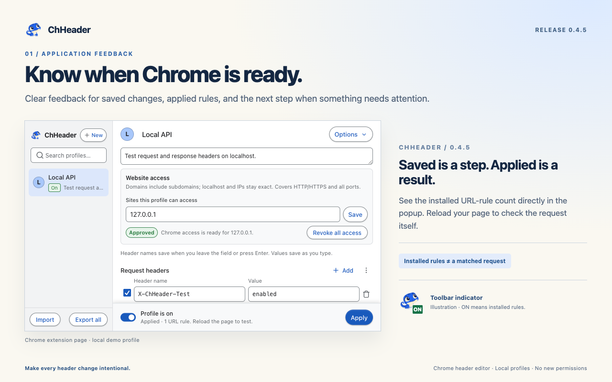
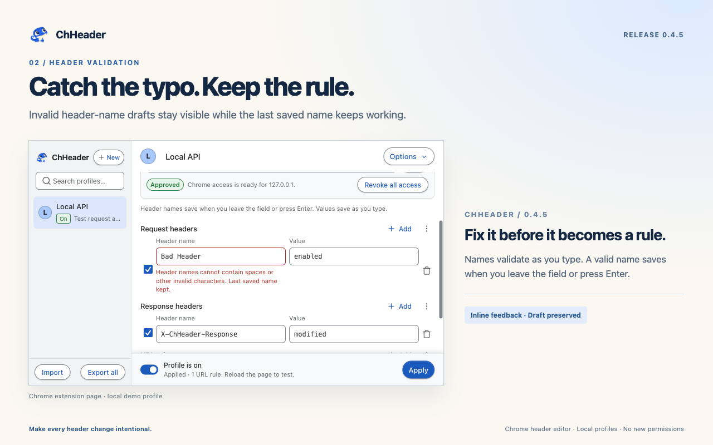
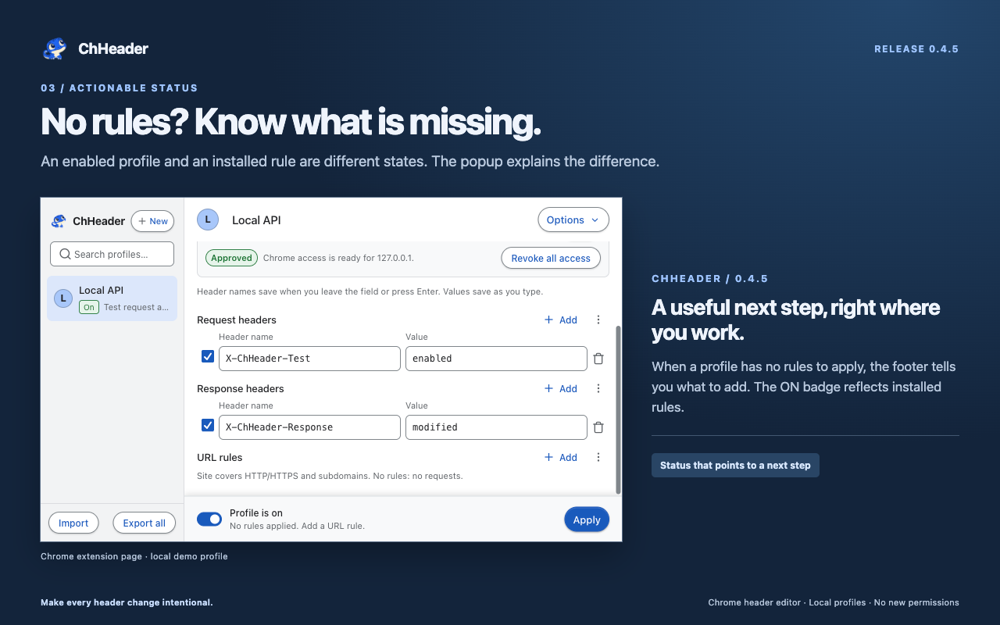
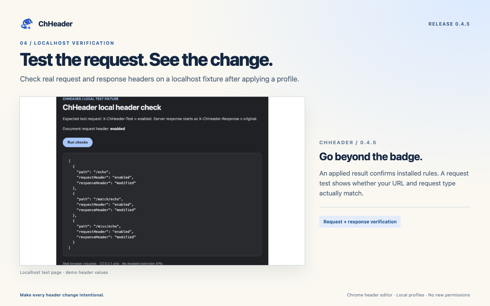
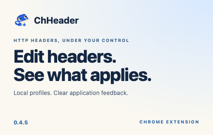

# ChHeader 0.4.5 visuals

Version 0.4.5 makes header changes easier to understand: application feedback shows
what Chrome accepted, inline validation keeps invalid drafts from replacing saved
names, and empty-rule messages explain what to add. The toolbar's ON badge reflects
installed rules. A separate request test confirms whether a request matched.

These curated PNGs accompany the [0.4.5 release](https://github.com/kahwee/ch-header/releases/tag/v0.4.5).
Their publication here does not indicate Chrome Web Store approval or availability.

## Release overview — 1200 × 630

Application feedback, inline header validation, and an ON badge based on installed
rules. Profiles and application status remain local, with no new permissions.

## Know when Chrome is ready — 1280 × 800

See whether changes are saved and rules are applied, with an installed URL-rule
count. Reload the page to test the request itself. The separate toolbar indicator
is a labeled illustration.

## Catch the typo. Keep the rule. — 1280 × 800

Header names validate as you type. An invalid draft stays visible while the last
saved name keeps working. Repair it, then leave the field or press Enter to save.

## No rules? Know what is missing. — 1280 × 800

An enabled profile does not always produce a rule. ChHeader explains what is
missing, and the ON badge reflects installed rules rather than the switch alone.

## Test the request. See the change. — 1280 × 800

The Local API demo verifies request and response changes at `127.0.0.1:3002`:
`X-ChHeader-Test: enabled` on the request and `X-ChHeader-Response: modified`
on the response. These results are scoped to the localhost demo.

## Small promotional tile — 440 × 280

Edit headers. See what applies. Local profiles and clear application feedback.

## Provenance

The embedded product screenshots show the actual production **extension page** in
Chrome for Testing 150 at 744 × 440, captured September 25, 2026 from source commit
`92c38b6eaea4a5b1d30e1779089d57988dce01ad`. They are not native toolbar-popup
screenshots or Storybook renders. Editorial backgrounds and copy surround unchanged
screenshots; the overview scales its screenshot proportionally. The network visual
contains a separate actual localhost test-page capture.

The application-feedback card's **Toolbar indicator** is an explicitly labeled
illustration using the existing gecko icon and a drawn ON badge. The promotional
tile is brand artwork, not a browser screenshot.

All six exports were checked for dimensions and visually inspected. After network
testing, disabling the profile and revoking access restored absent demo request
headers and original response values on all three tested endpoints. Dynamic rules
and website grants were empty, the badge was cleared, and the fixture was stopped.
Raw captures, editable layouts, and run-specific QA evidence remain local.
